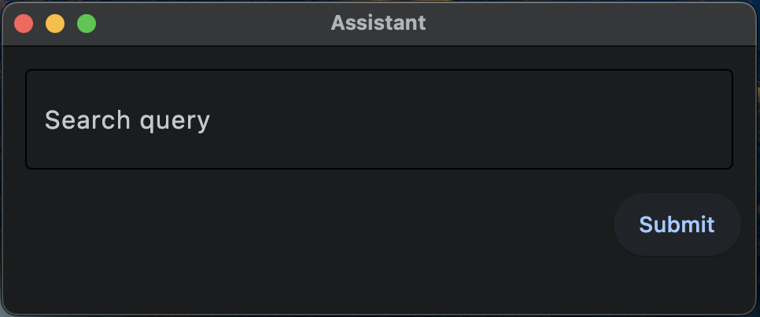

# Dialogs Google Image Search

This robot demonstrates the use of the [`RPA.Dialogs`](https://robocorp.com/docs/libraries/rpa-framework/rpa-dialogs) library to create a simple user interface to allow the user to choose a search query for an image in Google Images Search.

Click the link below to get to the code:

[tasks.robot](./tasks.robot)

> You can find more information on this example robot on [Robocorp's documentation site](https://robocorp.com/docs/development-howtos/dialogs-assistant/how-to-collect-input-from-users).
